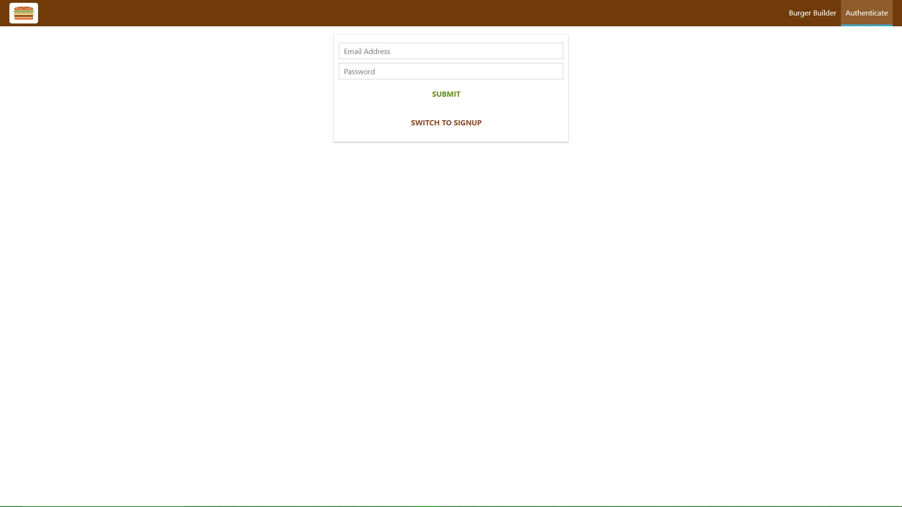

# Burger_builder_React.js

This burger builder web application I did is based on a tutorial from a Udemy course. It is built using key principles on React.js platform. This responsive application was built using mobile-first approach. I am always learning more and growing my skills continuously. Here you will see some samples of the application below.

